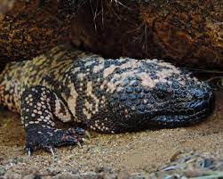

```{r setup, include=FALSE, warning=FALSE}
knitr::opts_chunk$set(echo = TRUE)

librarian::shelf(caret, dismo, dplyr, DT, GGally, ggplot2, here, 
                 htmltools, leaflet, mapview, mgcv, maptools, pdp, purrr, 
                 ranger, raster, readr, rgbif, rgdal, rJava, rpart, rpart.plot, rsample,
                 sdmpredictors, sf, skimr, spocc, tidyr, usdm, vip)

select <- dplyr::select # overwrite raster::select

options(
  warn = -1,
  scipen = 999,
  readr.show_col_types = F)
set.seed(15)

# graphical theme
ggplot2::theme_set(ggplot2::theme_light())

dir_data <- here("data")
```



# 1a: Explore

## Gather species data for _Heloderma suspectum_

```{r}
obs_csv <- file.path(dir_data, "obs.csv")
obs_geo <- file.path(dir_data, "obs.geojson")
redo    <- FALSE

if (!file.exists(obs_geo) | redo){
  # get species occurrence data from GBIF with coordinates
  (res <- spocc::occ(
    query = 'Heloderma suspectum', 
    from = 'gbif', has_coords = T,
    limit = 10000))
  
  # extract data frame from result
  df <- res$gbif$data[[1]] 
  readr::write_csv(df, obs_csv)
  
  # convert to points of observation from lon/lat columns in data frame
  obs <- df %>% 
    sf::st_as_sf(
      coords = c("longitude", "latitude"),
      crs = st_crs(4326)) %>% 
    select(prov, key) %>% # save space (joinable from obs_csv)
    subset(!key %in% c(861689291, 1050659944, 1145541957, 686703568)) 
  sf::write_sf(obs, obs_geo, delete_dsn=T)
}
obs <- sf::read_sf(obs_geo)
nrow(obs) # number of rows
```

```{r}
mapview::mapview(obs, map.types = "OpenTopoMap")
```

#### Cleaning steps

Several observations were rerecorded with a lat/long of (0,0) as indicated by the dots off the coast of Africa (visible if the above code is run without line 58). Additionally, an investigation of Gila Monster habitat on Google shows that the points in the Midwest and California coast are far out of habitable range. Sources disagree on whether or not the true range extends into southern Mexico, so for the purposes of this analysis those observations will remain in the dataset.

#### Total observations

After removing these four bad observations, we are left with `r nrow(obs)` observations of _Heloderma suspectum_ from the GBIF database.

#### Environmental layer rationale

I used the same default layers presented in the lab template: `WC_alt`, `WC_bio1`, `WC_bio2`, `ER_tri`, `ER_topoWet`.

I concluded that these would be appropriate metrics because[^1]: 

- Annual mean temp
- Mean diurnal temp range
- Topographic wetness

Are all different ways of measuring climactic variables that are associated with deserts, the Gila Monster's native habitat. Including all three should allow us to identify which features of the desert might be the most important in identifying suitable habitat.

- Altitude
- Terrain roughness

Both measure adjacent metrics that could help narrow down the range: for example, as slow-moving reptiles they may prefer a sweet spot of terrain roughness that isn't too hard for them to navigate but also provides enough nooks and crannies to hide in. Altitude is somewhat of an intermediary between terrain and temperature variables, with lower elevations often flatter in the Southwest and also warmer.

[^1]: Rationale are based off my own intuition and general familiarity with the species, not an actual literature search.

## Environmental Data

```{r}
# choosing terrestrial
env_datasets <- sdmpredictors::list_datasets(terrestrial = TRUE, marine = FALSE)

# choose datasets for a vector
env_datasets_vec <- c("WorldClim", "ENVIREM")

# get layers
env_layers <- sdmpredictors::list_layers(env_datasets_vec)

# choose layers after some inspection and perhaps consulting literature
env_layers_vec <- c("WC_alt", "WC_bio1", "WC_bio2", "ER_tri", "ER_topoWet")

# get layers
env_stack <- load_layers(env_layers_vec)

# interactive plot layers, hiding all but first (select others)
# mapview(env_stack, hide = T) # makes the html too big for Github
plot(env_stack, nc=2)
```

```{r}
obs_hull_geo  <- file.path(dir_data, "obs_hull.geojson")
env_stack_grd <- file.path(dir_data, "env_stack.grd")

if (!file.exists(obs_hull_geo) | redo){
  # make convex hull around points of observation
  obs_hull <- sf::st_convex_hull(st_union(obs))
  
  # save obs hull
  write_sf(obs_hull, obs_hull_geo)
}
obs_hull <- read_sf(obs_hull_geo)
```

```{r}
# show points on map
mapview(
  list(obs, obs_hull), map.types = "OpenTopoMap")
```

```{r}
if (!file.exists(env_stack_grd) | redo){
  obs_hull_sp <- sf::as_Spatial(obs_hull)
  env_stack <- raster::mask(env_stack, obs_hull_sp) %>% 
    raster::crop(extent(obs_hull_sp))
  writeRaster(env_stack, env_stack_grd, overwrite=T)  
}
env_stack <- stack(env_stack_grd)

# show map
# mapview(obs) + 
#   mapview(env_stack, hide = T) # makes html too big for Github
plot(env_stack, nc=2)
```

## Create & Combine Pseudo-Absences

```{r}
absence_geo <- file.path(dir_data, "absence.geojson")
pts_geo     <- file.path(dir_data, "pts.geojson")
pts_env_csv <- file.path(dir_data, "pts_env.csv")

if (!file.exists(absence_geo) | redo){
  # get raster count of observations
  r_obs <- rasterize(
    sf::as_Spatial(obs), env_stack[[1]], field=1, fun='count')
  
  # show map
  # mapview(obs) + 
  #   mapview(r_obs)
  
  # create mask for 
  r_mask <- mask(env_stack[[1]] > -Inf, r_obs, inverse=T)
  
  # generate random points inside mask
  absence <- dismo::randomPoints(r_mask, nrow(obs)) %>% 
    as_tibble() %>% 
    st_as_sf(coords = c("x", "y"), crs = 4326)
  
  write_sf(absence, absence_geo, delete_dsn=T)
}
absence <- read_sf(absence_geo)
```


```{r}
# show map of presence (ie obs) and absence
mapview(obs, col.regions = "green") + 
  mapview(absence, col.regions = "gray")
```

```{r}
if (!file.exists(pts_env_csv) | redo){

  # combine presence and absence into single set of labeled points 
  pts <- rbind(
    obs %>% 
      mutate(
        present = 1) %>% 
      select(present, key),
    absence %>% 
      mutate(
        present = 0,
        key     = NA)) %>% 
    mutate(
      ID = 1:n()) %>% 
    relocate(ID)
  write_sf(pts, pts_geo, delete_dsn=T)

  # extract raster values for points
  pts_env <- raster::extract(env_stack, as_Spatial(pts), df=TRUE) %>% 
    tibble() %>% 
    # join present and geometry columns to raster value results for points
    left_join(
      pts %>% 
        select(ID, present),
      by = "ID") %>% 
    relocate(present, .after = ID) %>% 
    # extract lon, lat as single columns
    mutate(
      #present = factor(present),
      lon = st_coordinates(geometry)[,1],
      lat = st_coordinates(geometry)[,2]) %>% 
    select(-geometry)
  write_csv(pts_env, pts_env_csv)
}
pts_env <- read_csv(pts_env_csv)
```

## Term Plots

```{r}
pts_env %>% 
  select(-ID) %>% 
  mutate(
    present = factor(present)) %>% 
  pivot_longer(-present) %>% 
  ggplot() +
  geom_density(aes(x = value, fill = present)) + 
  scale_fill_manual(values = alpha(c("gray", "green"), 0.5)) +
  scale_x_continuous(expand=c(0,0)) +
  scale_y_continuous(expand=c(0,0)) +
  theme_bw() + 
  facet_wrap(~name, scales = "free") +
  theme(
    legend.position = c(1, 0),
    legend.justification = c(1, 0))
```

# 1b: Regress

```{r}
GGally::ggpairs(
  select(pts_env, -ID),
  aes(color = factor(present)))
```

## Logistic Regressions

### Linear Model

```{r}
d <- pts_env %>% 
  select(-ID) %>%  # remove terms we don't want to model
  tidyr::drop_na() # drop the rows with NA values
nrow(d)

# fit a linear model
mdl <- lm(present ~ ., data = d)
summary(mdl)
```

```{r}
y_predict <- predict(mdl, d, type="response")
y_true    <- d$present

range(y_predict)
```

#### GLM

```{r}
# fit a generalized linear model with a binomial logit link function
mdl_logit <- glm(present ~ ., family = binomial(link="logit"), data = d)
summary(mdl_logit)

y_predict <- predict(mdl_logit, d, type="response")

range(y_predict)
```

```{r}
# show term plots
termplot(mdl_logit, partial.resid = TRUE, se = TRUE, main = F, ylim="free")
```

#### GAM

```{r}
mdl_add <- mgcv::gam(
  formula = present ~ s(WC_alt) + s(WC_bio1) + 
    s(WC_bio2) + s(ER_tri) + s(ER_topoWet) + s(lon) + s(lat), 
  family = binomial, data = d)
summary(mdl_add)
```

```{r}
# show term plots
plot(mdl_add, scale=0)
```

#### GAM presence contribution

Most environmental variables hover around zero, jump around, and/or have large error margins. Interestingly, `WC_bio2` (mean diurnal temperature range) is the most consistent as both a predictor of presence **and** absence: at low levels it is predictive of presence, but at high levels is predictive of absence. Longitude is largely a negative predictor, but with exceptionally low confidence at higher values.

### Maximum Entropy

```{r}
mdl_maxent_rds <- file.path(dir_data, "mdl_maxent.rds")
```

```{r}
# get presence-only observation points (maxent extracts raster values for you)
obs_geo <- file.path(dir_data, "obs.geojson")
obs_sp <- read_sf(obs_geo) %>% 
  sf::as_Spatial() # maxent prefers sp::SpatialPoints over newer sf::sf class

# fit a maximum entropy model
if (!file.exists(mdl_maxent_rds)){
  mdl_mx <- maxent(env_stack, obs_sp)
  readr::write_rds(mdl_mx, mdl_maxent_rds)
}
mdl_mx <- read_rds(mdl_maxent_rds)
```

```{r}
# plot variable contributions per predictor
plot(mdl_mx)

# plot term plots
response(mdl_mx)
```

```{r}
# predict
y_predict <- predict(env_stack, mdl_mx) #, ext=ext, progress='')

plot(y_predict, main='Maxent, raw prediction')
data(wrld_simpl, package="maptools")
plot(wrld_simpl, add=TRUE, border='dark grey')
```

#### Maxent presence contribution

Low values of `WC_alt` is a strong positive predictor, as is low `WC_bio1`. Likewise, high values of both those variables are strong negative predictors. Interestingly, Maxent identifies the opposite effect of `WC_bio2` as the GAM did: here, high `WC_bio2` is a positive predictor.

# 1c: Trees

```{r}
# read data
pts_env <- read_csv(pts_env_csv)
d <- pts_env %>% 
  select(-ID) %>%                   # not used as a predictor x
  mutate(
    present = factor(present)) %>%  # categorical response
  na.omit()                         # drop rows with NA
```

## Decision Trees

```{r}
# create training set with 80% of full data
d_split  <- rsample::initial_split(d, prop = 0.8, strata = "present")
d_train  <- rsample::training(d_split)

# show number of rows present is 0 vs 1 in each df
table(d$present)
table(d_train$present)
```

```{r}
# simplest tree with maxdepth = 1
mdl1 <- rpart(
  present ~ ., data = d_train, 
  control = list(
    cp = 0, minbucket = 5, maxdepth = 1))
mdl1
```

```{r}
# plot tree (depth=1)
par(mar = c(1, 1, 1, 1))
rpart.plot(mdl1)
```

```{r}
# decision tree with default settings
mdl <- rpart(present ~ ., data = d_train)
mdl
```

```{r}
rpart.plot(mdl)

# plot complexity parameter
plotcp(mdl)

# rpart cross validation results
mdl$cptable
```

```{r}
# caret cross validation results
mdl_caret <- train(
  present ~ .,
  data       = d_train,
  method     = "rpart",
  trControl  = trainControl(method = "cv", number = 10),
  tuneLength = 20)

ggplot(mdl_caret)

vip(mdl_caret, num_features = 40, bar = FALSE)
```

#### Complexity plot threshold

According to the R Documantation for `plotcp()`, "A good choice of cp for pruning is often the leftmost value for which the mean lies below the horizontal line." With this in mind, a tree with 11 branches is recommended. 

#### 3 most important variables

The variable importance chart above lists `lon`, `lat`, and `WC_alt` as the most important variables in determining presence/absence.

However, the nodes of the tree itself show a slightly different story: the entire tree is made up on splits of latitude and longitude, with the exception of a single node based on `ER_topoWet`. So while the importance of lat/long is clear, no decisions in the tree are made based on `WC_alt`, and `ER_topoWet` does show up in the tree despite being ranked as very low importance.

## Random Forests

```{r}
# number of features
n_features <- length(setdiff(names(d_train), "present"))

# fit a default random forest model
mdl_rf <- ranger(present ~ ., data = d_train)

# get out of the box RMSE
(default_rmse <- sqrt(mdl_rf$prediction.error))
```

```{r}
# re-run model with impurity-based variable importance
mdl_impurity <- ranger(
  present ~ ., data = d_train,
  importance = "impurity")

# re-run model with permutation-based variable importance
mdl_permutation <- ranger(
  present ~ ., data = d_train,
  importance = "permutation")

p1 <- vip::vip(mdl_impurity, bar = FALSE)
p2 <- vip::vip(mdl_permutation, bar = FALSE)

gridExtra::grid.arrange(p1, p2, nrow = 1)
```

#### Variable importance in rpart vs Random Forest

Because Random Forest uses many trees combined to come up with the best overall solution, it may not line up with the single decision tree created above. This can be seen slightly differently in each of the variable importance charts: the permutation-based importance is in mostly the same order as the individual decision tree (only lat/lon are switched), while the impurity-based importance varies with `ER_topoWet` gaining importance over `WC_bio2`.

# 1d: Evaluate

```{r}
# read points of observation: presence (1) and absence (0)
pts <- read_sf(pts_geo)

```

## Training/Testing Data Split

```{r}
# create training set with 80% of full data
pts_split  <- rsample::initial_split(
  pts, prop = 0.8, strata = "present")
pts_train  <- rsample::training(pts_split)
pts_test   <- rsample::testing(pts_split)

pts_train_p <- pts_train %>% 
  filter(present == 1) %>% 
  as_Spatial()
pts_train_a <- pts_train %>% 
  filter(present == 0) %>% 
  as_Spatial()
```

## Model Selection

```{r}
# show pairs plot before multicollinearity reduction with vifcor()
pairs(env_stack)

# calculate variance inflation factor per predictor, a metric of multicollinearity between variables
vif(env_stack)
```

```{r}
# stepwise reduce predictors, based on a max correlation of 0.7 (max 1)
v <- vifcor(env_stack, th=0.7) 
v

# reduce enviromental raster stack by 
env_stack_v <- usdm::exclude(env_stack, v)

# show pairs plot after multicollinearity reduction with vifcor()
pairs(env_stack_v)
```

```{r}
mdl_maxv_rds  <- file.path(dir_data, "mdl_maxv.rds")

# fit a maximum entropy model
if (!file.exists(mdl_maxv_rds)){
  mdl_maxv <- maxent(env_stack_v, sf::as_Spatial(pts_train))
  readr::write_rds(mdl_maxv, mdl_maxv_rds)
}
# mdl_maxv <- read_rds(mdl_maxv.rds)
mdl_maxv <- maxent(env_stack_v, sf::as_Spatial(pts_train))

# plot variable contributions per predictor
plot(mdl_maxv)

# plot term plots
dismo::response(mdl_maxv)
# note: JVM was messed up so had to run `rJava::.jpackage("dismo")` to be able to run it

# predict
y_maxv <- predict(env_stack, mdl_maxv) #, ext=ext, progress='')

plot(y_maxv, main='Maxent, raw prediction')
data(wrld_simpl, package="maptools")
plot(wrld_simpl, add=TRUE, border='dark grey')
```
#### Variables removed due to multicolinearity; rank of remaining variables

`ER_topoWet` and `WC_alt` were removed due to multicolinearity. Of the remaining 3 variables, `WC_bio2` is the most important, followed by `WC_bio1`, and finally `ER_tri` is the least important.

## Model Performance

```{r}
pts_test_p <- pts_test %>% 
  filter(present == 1) %>% 
  as_Spatial()
pts_test_a <- pts_test %>% 
  filter(present == 0) %>% 
  as_Spatial()

# y_maxv <- predict(mdl_maxv, env_stack)
# plot(y_maxv)

e <- dismo::evaluate(
  p     = pts_test_p,
  a     = pts_test_a, 
  model = mdl_maxv,
  x     = env_stack)
e
```
```{r}
plot(e, 'ROC')

thr <- threshold(e)[['spec_sens']]
print(paste(thr, "is the ROC threshold value"))

p_true <- na.omit(raster::extract(y_maxv, pts_test_p) >= thr)
a_true <- na.omit(raster::extract(y_maxv, pts_test_a) < thr)

# (t)rue/(f)alse (p)ositive/(n)egative rates
tpr <- sum(p_true)/length(p_true)
fnr <- sum(!p_true)/length(p_true)
fpr <- sum(!a_true)/length(a_true)
tnr <- sum(a_true)/length(a_true)

matrix(
  c(tpr, fnr,
    fpr, tnr), 
  nrow=2, dimnames = list(
    c("present_obs", "absent_obs"),
    c("present_pred", "absent_pred")))

# add point to ROC plot
points(fpr, tpr, pch=23, bg="blue")

plot(y_maxv > thr, main='Maxent binary habitat')
data(wrld_simpl, package="maptools")
plot(wrld_simpl, add=TRUE, border='dark grey')
```